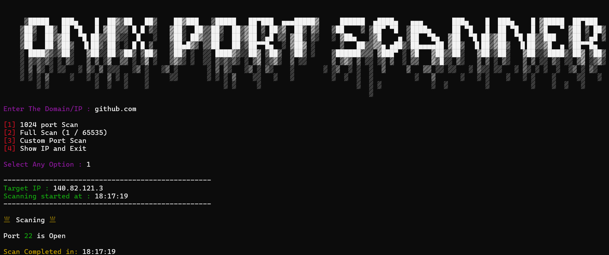

<p align="center">
    
</p>


##

# Warning

Onix Phisher is only for educational purposes only and it can be dangerous for social media and its illegal

Any illegal activities is your responsibility and its not related to Onix Phisher !

Be carefull of using it and have fun . 

##

<p align="center">
    
</p>

## Installation

- Clone this repository 
```
   Git clone https://github.com/T-Onix/Onix-phisher.git
```
- Then go to cloned directory
```
   cd Onix_Phisher
```
- Finally run the program
```
   python Onix.py
```
##

<p align="center">
    
</p>

## Port Scanner

Onix Phisher has its own port scanner that you can find ip ports that you get from users 

it can help you in lots of situations without needing any other apps
 
## Tested on

- Windows 